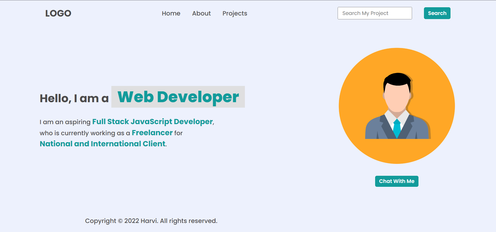

# Task 1 : Update the list section for Header and Footer

## Expected output


## Related Code

Adding 'Hire Me' list item :

```
let ul = document.querySelector('ul'); //selecting the list in header
let li = document.createElement('li'); // creating a new li element to add
li.innerText = 'Hire Me'; // adding text inside li
ul.append(li); // adding li to list

```
Updating list item 'Contact' to 'Projects' :

```

```
Removing the list with logos from 'footer' :

```
const footer = document.querySelector('footer'); //seletcting the entire footer
const logo = document.querySelector('footer>ul'); //selecting the list from footer
footer.removeChild(logo); // removing the list from footer

```
# Task 2 : Update the placeholder text in Search Bar

## Expected output



## Related Code

Hidding 'Hire Me' list item :

```
li.style.display = "none";

```
Updating the text in Search Bar placeholder :

```
const input = document.querySelector('input');//selecting input tag
input.placeholder = 'Search My Project' //updating the placeholder value

```

# Task 3 : Update the placeholder text in Search Bar to original

## Expected output


## Related Code

Updating the text in Search Bar placeholder to original :

```
input.placeholder = 'Search' //updating the placeholder value

```