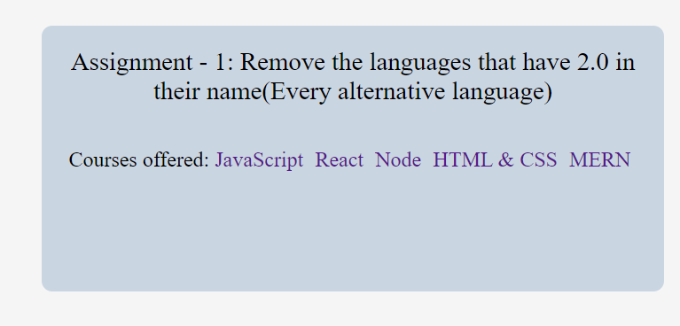

# Task 1 : Removing alternate languages


## Expected output



## Related Code

```
const languages = document.querySelectorAll('.main__languages>a');//selecting all the tags that have the course name this will return a NodeList
for(let i=1;i<10;i=i+2)
    {
        languages[i].style.display = 'none';
    }

<!--
We can also convert the NodeList to an array and then remove same thing
 let arr = Array.from(languages);creating an arr from the list -->
```
# Task 2 : Updating the text in input box and submit

## Expected output


## Related Code

```
const input = document.querySelector('input');//selecting the input tag
const submit = document.querySelector(".main__form-btn");//selecting the submit button
input.removeAttribute("disabled");//making the input box active 
submit.removeAttribute("disabled");//making the button active

<!-- When the submit button is clicked the page reloads and the JS in the console clears making the languages come back automatically -->
```