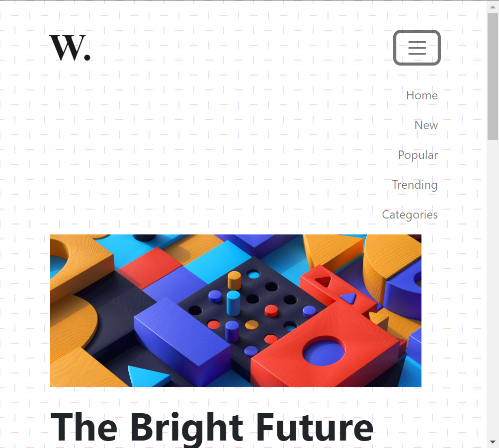

# Task 1 : Make the Right Block Scrollable


## Expected output


## Related Code

```
const block = document.querySelector('.col-lg-4');//selecting element block
block.style.border = "solid 2px red";//giving it a border
block.style.overflow = 'scroll';//making it scrollable
<!-- scroll will make it scrollable both vertically and horizontally 
overflow-y: scroll makes it appear only veritically
auto value will only make the scroll bar appear if the content can be scrolled if it fits perfectly it will not be visible -->
```

# Task 2 : Changing the background


## Expected output


## Related Code

```
let backgroundImage = document.querySelector("body");//selecting body
backgroundImage.style.background= "none";//removing the background
```

# Task 3 : 


## Expected output



## Related Code

```
let navBar = document.querySelector(".navbar-toggler");//selecting navbar
navBar.addEventListener('click' , function(){//giving On-Click functionality 
  document.querySelector("#navbarTogglerDemo01").classList.toggle("collapse");
})
<!-- .classList.remove('collapse') will also work -->
```

